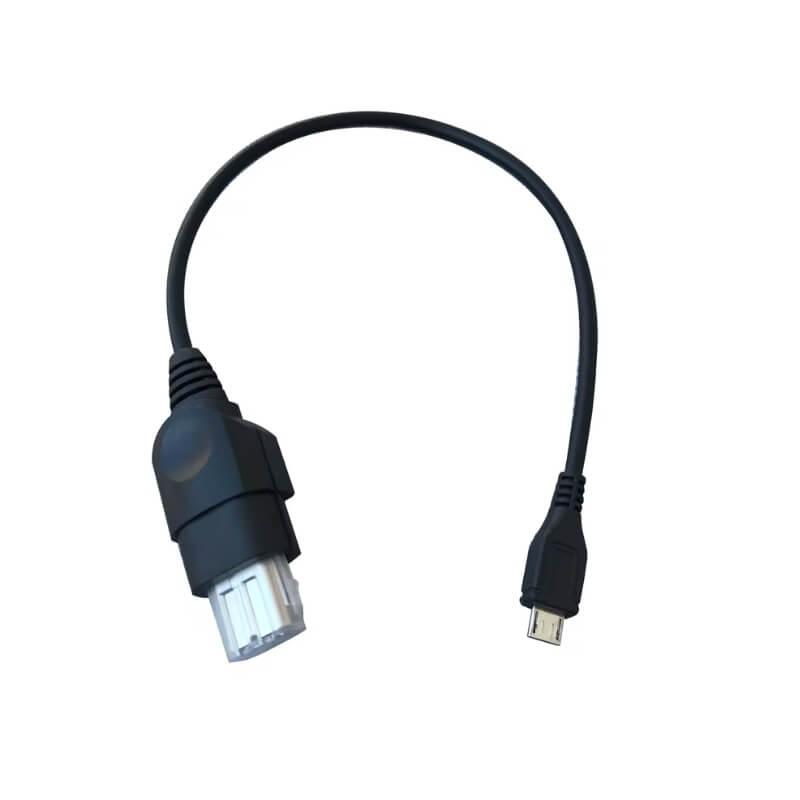

# BROGX HW1 Build Instructions

## Materials Needed

- **ESP32-DEVKITC** with one of the following modules: ESP-WROOM-32, ESP32-WROOM-32D, or ESP-WROOM-32E.
  
  Example: Using [ESP32-DEVKITC V4] with an ESP32-WROOM-32D module.

  All [ESP32-WROOM-32/E/UE/D/U](https://products.espressif.com/#/product-comparison?names=ESP32-WROOM-32E-N4,ESP32-WROOM-32UE-N4,ESP32-WROOM-32D-N4,ESP32-WROOM-32U-N4,ESP32-WROOM-32-N4,ESP32-WROOM-32E-H4,ESP32-WROOM-32UE-H4,ESP32-WROOM-32D-H4,ESP32-WROOM-32U-H4&type=Module) modules with 26 GPIO pins and 4MB QUAD FLASH are compatible.

  

- Up to four **Arduino Pro Micro/Leonardo boards** — [Any clone](https://www.aliexpress.com/item/New-Pro-Micro-for-arduino-ATmega32U4-5V-16MHz-Module-with-2-row-pin-header-For-Leonardo/32768308647.html). Ensure the 5V/16MHz variant is used.

  

- Up to four **[Xbox Controller Port to MicroUSB cables](../../Images/Original-XBOX-Micro-USB-to-Controller-Port-Cable.jpg)** — available from [Alibaba (large MOQ!)](https://www.alibaba.com/product-detail/for-XBOX-MicroUSB-Cable-for-Xbox_62222784495.html) or DIY.

  

- **[Logic Level Converter (Bi-Directional)](../../Images/spark_level_shifter.jpg)** — [SparkFun](https://www.sparkfun.com/products/12009).

  

---

## Wiring

Refer to the [PDF Schematic](BROgx_HW1.pdf) for detailed connections.

You can connect the ESP32 to one or up to four Arduino boards. Each Arduino Pro Micro must be assigned a unique player ID:

- **Player 1**: Connect pins (A2) and (A1) on the Arduino to ground (GND).
- **Player 2** (optional): Connect pin (A1) to ground (GND).
- **Player 3** (optional): Connect pin (A2) to ground (GND).
- **Player 4** (optional): No additional pins connected to ground.

### Arduino for Player 1:
- Connect the right-side (RAW) pin to the left-side bottom (5V) pin on the ESP32 and to the level shifter (HV).
- Connect (GND) from the Player 1 Arduino to the level shifter (GND) on the HV side.
- Connect the left-side (D2/SDA) pin to the level shifter (HV1).
- Connect the left-side (D3/SCL) pin to the level shifter (HV2).

 

  

### Optional (Player 2, Player 3, Player 4):
- Connect (GND) from all Arduino boards together (including the board for Player 1).
- Connect (D2/SDA) from all boards together.
- Connect (D3/SCL) from all boards together.

### ESP32 Connections:
- Connect the left-side top (3V3) pin on the ESP32 to the level shifter (LV).
- Connect the ground (GND) pin from the ESP32 to the level shifter (GND) on the LV side.
- Connect GPIO21 (SDA) on the ESP32 to the level shifter (LV1).
- Connect GPIO22 (SCL) on the ESP32 to the level shifter (LV2).

### Important Pin Configuration:
**TODO: FIX IN CODE**
- **In the code**, ESP32 SDA is set to **22** and SCL to **21**, opposite as in diagrams **!!!**
Change
- Connect GPIO21 on the ESP32 to the level shifter (LV2)  
- Connect GPIO22 on the ESP32 to the level shifter (LV1).

 
    

Finally, connect each used Arduino board to the Xbox using the **[Xbox Controller Port to MicroUSB cables](../../Images/Original-XBOX-Micro-USB-to-Controller-Port-Cable.jpg)**

---

Enjoy your wireless Xbox gaming experience with BROGX!
