# BROGX HW2 Build Instruction

"HW2 specification require a lot more connection and as such is not recommended for novice in electronic at all.   
HW2 main feature is active port connection detection.   
This allow making internal install without intefering with wired controllers (Wired controllers take precedance on the bus).   
This also allow external adapter with multiple cable plugs to not require every plugs to be connected.  
      
Power & Reset management are optional feature supported by HW2 aswell.  
  For this build, not all options described here are obligatory to complete the project — also some can be done in different ways.  
Below you’ll find the essential information on how to make it work.  
Be aware that this build is based on DEVKIT modules, they got already some protection build in, wchich need to be implemented in case of building mod from barebone modules.  
This guide focuses on  hardware integration.

Refer to the [PDF Schematic](BROGX-HW2.pdf) for detailed wiring and components.  

--- 
# Materials Needed  
### ESP32-DEVKITC with ESP-WROOM-32, ESP32-WROOM-32D, ESP-WROOM-32E, or ESP-WROOM-32U module.  
  * ESP32-WROOM-32U (has socket for external antenna) - Best choice for HW2 internal build.  
  * ESP32-DEVKITC V4 with ESP32-WROOM-32D module.  
  * All [ESP32-WROOM modules](https://products.espressif.com/#/product-comparison?names=ESP32-WROOM-32E-N4,ESP32-WROOM-32UE-N4,ESP32-WROOM-32D-N4,ESP32-WROOM-32U-N4,ESP32-WROOM-32-N4,ESP32-WROOM-32E-H4,ESP32-WROOM-32UE-H4,ESP32-WROOM-32D-H4,ESP32-WROOM-32U-H4&type=Module) with 26 GPIOs and 4MB QUAD Flash are compatible.  
  

* Up to 4× Arduino Pro Micro / Leonardo (5V / 16MHz version) — [example clone](https://www.aliexpress.com/item/New-Pro-Micro-for-arduino-ATmega32U4-5V-16MHz-Module-with-2-row-pin-header-For-Leonardo/32768308647.html)  
  

    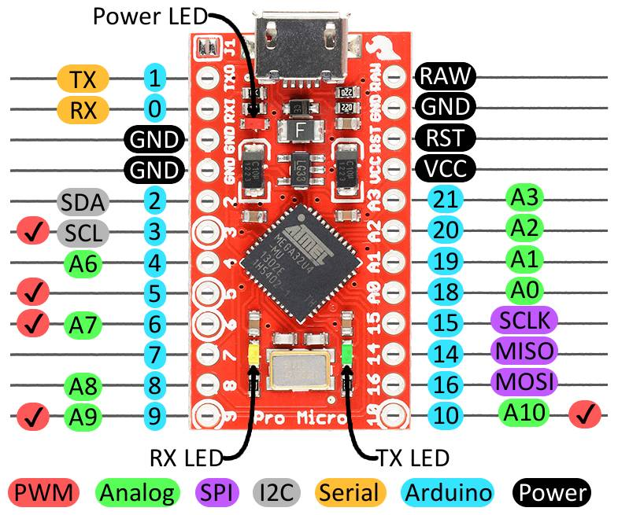
    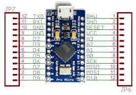
  

* [Logic Level Converter (Bi-Directional)](https://www.sparkfun.com/products/12009)  
  
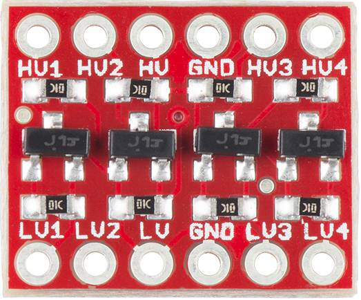

* Up to 4× Xbox Controller Port → MicroUSB cables for EXTERNAL HW2
  
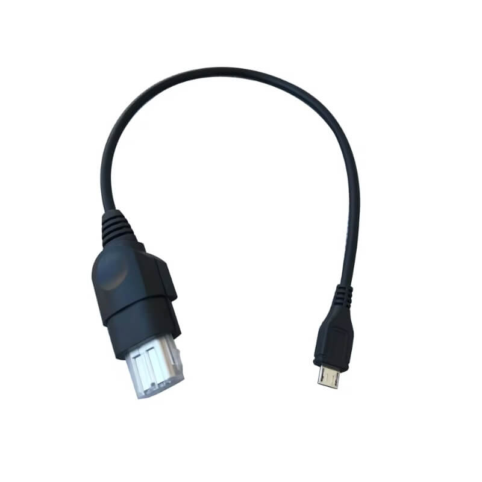

* Up to 4× MicroUSB plugs/cables for INTERNAL HW2.  
* Additional discrete components (optional) for extra functionality:
  - Port detection (“Current Trigger” circuit) — P/N MOSFETs, resistors  
  - Port detection via “Shield Isolation” — resistors  
  - Player status LEDs — LEDs, resistors  
  - Reuse of Xbox POWER / EJECT** buttons as ESP32 EN / BOOT — diodes, resistors, MOSFETs
    
# Connections  

 Arduino Basic Wiring (Same as HW1) 
| Player 1: A2 (pin 6) + A1 (pin 7) → GND   Player 2: A1 (pin 7) → GND    Player 3: A2 (pin 6) → GND    Player 4: No GND modifications |  
|:---|:---|  

# I²C

  

- Connect **RAW** from all Arduinos → Level Shifter (HV).  
- Connect **D2 (SDA, pin8)** from all Arduinos → Level Shifter **HV1**.  
- Connect **D3 (SCL, pin7)** from all Arduinos → Level Shifter **HV2**.  
- Connect **ESP32 3V3** → Level Shifter **LV**.  
- Connect **ESP32 GND** → Level Shifter **GND (LV side)**.  
- Connect **ESP32 GPIO21 (SDA)** → Level Shifter **LV1**.  
- Connect **ESP32 GPIO22 (SCL)** → Level Shifter **LV2**.  

⚠️ **Important:**  
The ESP32 I²C pins are swapped in code!  
In firmware:
- SDA = GPIO22  
- SCL = GPIO21  

So:  
- GPIO21 → Level Shifter **LV2**  
- GPIO22 → Level Shifter **LV1**

# GAMEPORTS

See [Gameport Schematic](BROGX-HW2_ARDUINOS_TO_PORTS.pdf) for wiring.  
You can use MicroUSB cables or solder directly.

<table>
  <tr>
    <td>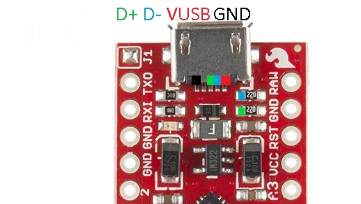</td>
    <td>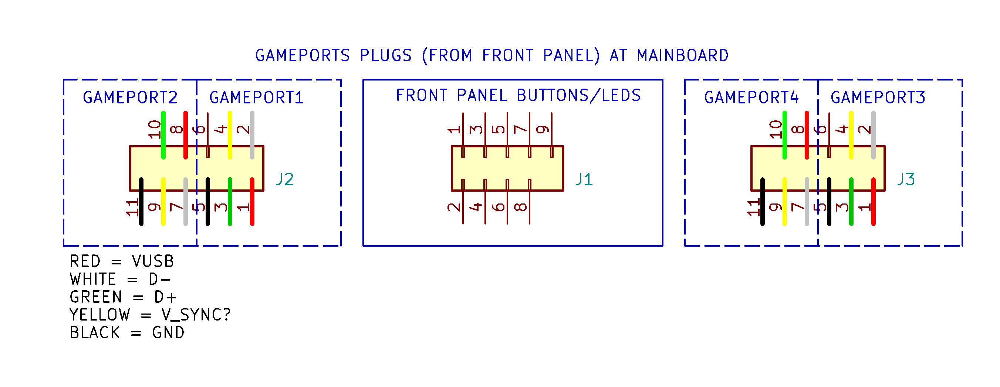</td>
  </tr>
</table>

**Player 1:**
- USB_D+ → Green (Pin3, Left Plug)  
- USB_D− → White (Pin2, Left Plug)  
- VUSB → Red (Pin1, Left Plug)  
- GND → Black (Pin5, Left Plug)

**Player 2:**
- USB_D+ → Green (Pin10, Left Plug)  
- USB_D− → White (Pin7, Left Plug)  
- VUSB → Red (Pin8, Left Plug)  
- GND → Black (Pin11, Left Plug)

**Player 3:**
- USB_D+ → Green (Pin3, Right Plug)  
- USB_D− → White (Pin2, Right Plug)  
- VUSB → Red (Pin1, Right Plug)  
- GND → Black (Pin5, Right Plug)

**Player 4:**
- USB_D+ → Green (Pin10, Right Plug)  
- USB_D− → White (Pin7, Right Plug)  
- VUSB → Red (Pin8, Right Plug)  
- GND → Black (Pin11, Right Plug)

# Port Detection

See [Port Detection](BROGX-HW2_PORT_DETECTION.pdf) for wiring.  

To avoid original wired controller and BlueRetro from interfering each other on the controller bus, some sort of mechanism need to be used to drive the corresponding port detection pin.

- **GPIO35 / GPIO36 / GPIO32 / GPIO33** on ESP32 are Port detect inputs for P1–P4.  
- Each port pin should be pulled **HIGH** for use with Arduino connected to the corresponding port.  
- **Unused ports** must not float, **10 kΩ pulldown**.
   
### OPTION 1: ~~Current Trigger / Current Mirror Detection~~

     deprecated: unstable during rumble
     causing controller disconect when rumble starts due to too high voltage drop - Not recomended now.
     Current mirror circuit got at output about 0,3V voltage drop in idle , with rumble on voltage drops under acceptable
     USB spec and controller disconnects.     
*If anybody skilled in electronics wants help and got idea how detection can be done pls contact me!
[Reddit](https://www.reddit.com/u/konwektor), or [Discord](https://discordapp.com/users/konwektor)*  

  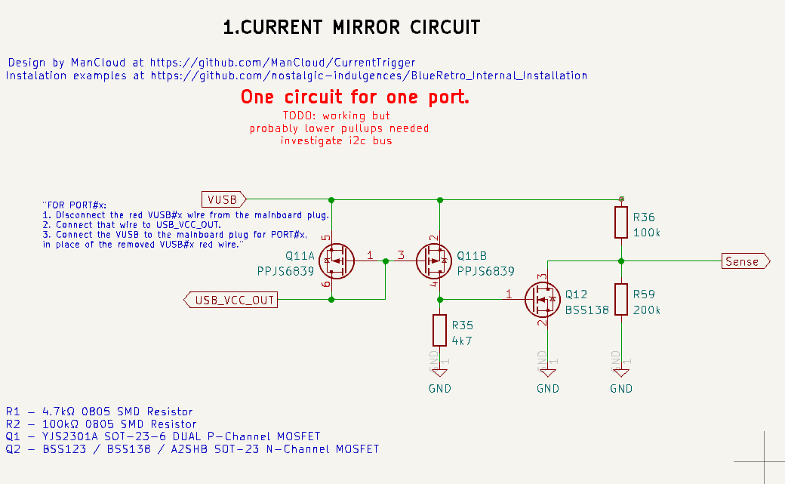

This circuit checks if any port is drawing current.  
If yes → output **SENSE = LOW**.  
Build one **Current Mirror circuit** for every required port  
Connect each circuit’s **SENSE** output to the corresponding **ESP32 GPIO** detection pin.  

### OPTION 2: PORT GND Isolation / GND Detection

- For enable active port detection, disconnect from gameport plug at Mainboard **BLACK** wire coming from front panel gameport:  
  Player1 left plug Pin5,  
  Player2 left plug Pin11,  
  Player3 right plug Pin5,  
  Player4 right plug Pin11  
- Connect that wire to the corresponding **ESP32 GPIO** port-detect pin.
- Pull each GPIO up to **3.3 V** through a **10 kΩ resistor**.  

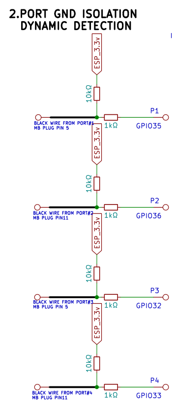  

***Explanation (example: Player 1):***
- Power goes from 3.3V thru 10 kΩ resistor to GPIO35 - GPIO35 is pulled HIGH.
- Black cable disconnected from Pin5(GND   CONTROLLER PORT1 
- GND (black cable) is connected to the Xbox gameport ground pin → no change.  
- When a wired controller is plugged:
- Shield of gamepad → port shield → GND connection pulls GPIO LOW.  
- Adapter detects this and **disables** the port (USB detach).  
- BT controllers are reassigned automatically.  
- When unplugged → GPIO returns HIGH → BT controller rebinds.  

⚠️ Requires solid shield-to-shield contact; may fail with poor grounding. 

This is made in opposit of Darthcloud solution:  
*"This require isolating each port shield from the system GND and connecting each port shield to the corresponding detect pin on the ESP32. Each pin need a 10K pull-up resistor as well."*

### OPTION 3: PULLUP ONLY / NO DETECTION  

**NOT RECOMMENDED**  	
Static port count without detection.  
To enable a port for BT devices, a 10kΩ resistor per port is needed.  
Pullup to ESP_3.3V power rail via resistor.  
Wired gamepad support on all ports enabled in this way will be permanently disabled.  

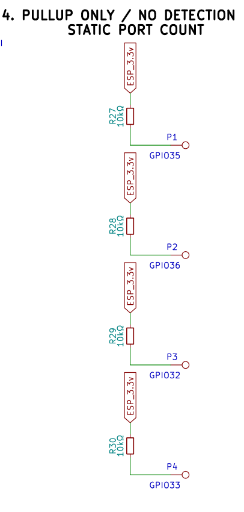
  

Connecting Wired gamepads to ports enabled in this way is in conflict with already used there Arduinos.  
Wired gamepads Will not work and cause problems, or even system hangs.  

     

### OPTION 4: PULLDOWN ONLY/ NO DETECTION PORT DISABLED FOR BT

After building port detection circuit using one of the methods above, not used detection pins should be pulled to GND thru 10kΩ resistors.
This will set gpio pins state to LOW, avoiding risk of floating.
Coresponding port is disabled by adapter for use with Bluetooth. 

  

---  

# FRONT PANEL BUTTONS
See [Front Panel](BROGX-HW2_FRONT_PANEL.pdf) for wiring.  

For **BlueRetro pairing/reset**, the ESP32’s original **EN** and **BOOT** buttons are used.  
This circuit allows:
- using **DVD_EJECT** and **POWER_ON/OFF** buttons for **BlueRetro functions** while keeping normal Xbox buttons operation.
- Buttons can trigger pairing/reset, plus standard Xbox control.
- possibility of switching XBOX OFF from connected Bluetooth wireless gamepad.
- possibility of switching XBOX ON from already paired Bluetooth wireless gamepad.(separate power supply for esp32 is needed).

  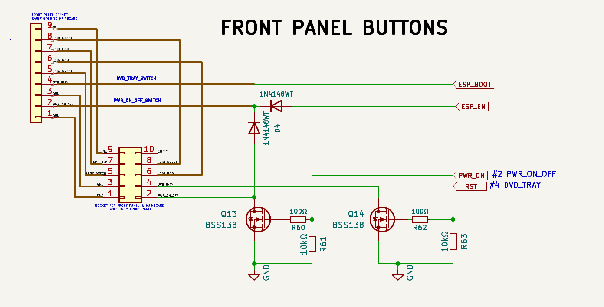

  
Without this circuit Xbox buttons behave normally (no BROGX control) - in this case ESP32 **EN** and **BOOT** buttons needed to be extended to outside of XBOX.  

Front Panel Cable
The cable comes from the **Xbox front panel**, carrying:
- **Power (ON/OFF)**  
- **DVD Tray Eject**  
- **LED indicators**
- **GND**

Connections:  
From the **double-row 9-pin connector** on the motherboard, **remove** wires:
- **Pin  (PWR_ON_OFF)**  
- **Pin 4 (DVD_TRAY)**
- 
Connect in this places:   
- **Q1 drain to Pin 2 (PWR_ON_OFF)**  
- **Q2 drain to Pin 4 (DVD_TRAY)**
- 
From ESP32:
- GPIO13 **PWR_ON** to Q1 gate via **R6 = 100 Ω**  
- GPIO13 **PWR_ON** to GND via **R7 = 10 kΩ**  
- GPIO14 **RST** to Q2 gate via **R8 = 100 Ω**  
- GPIO14 **RST** to GND via **R9 = 10 kΩ**  
- GPIO0 **ESP_BOOT**  to the cable from front panel button **DVD_TRAY_SWITCH** - cable previously at Pin 4  
- GPIO0 **ESP_BOOT** to GND  via **R8 = 100 Ω**  
- CHIP_PU **ESP_EN** diode (anode → ESP_EN), cathode → to the cable from front panel button **PWR_ON_OFF_SWITCH** - cable previously at Pin 2.
  
**Q1 drain**, diode (anode → drain), cathode → to the cable from front panel button **PWR_ON_OFF_SWITCH** - cable previously at pin 2.  
**Q1,Q2**  sources to GND.  

---  

# STATUS LEDS
See [STATUS LEDS](BROGX-HW2_STATUS_LEDS.pdf) for wiring.

  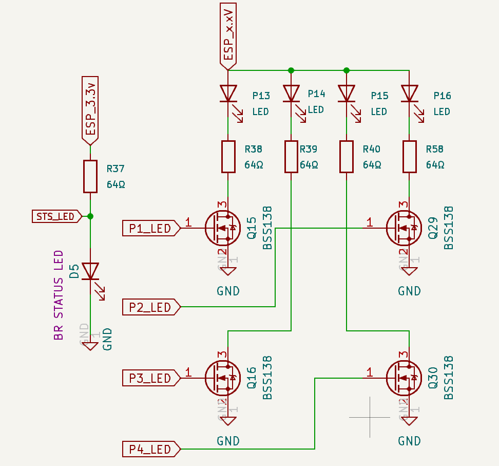

  
Player LEDs and BR Status LED (Optional).

**BR status LED IS HIGHLY RECOMMENDED**  
***BR status LED need to be connected to 3.3V rail, and only to 3.3V rail!***

User can always see/be sure what is happening with adapter; is it in pairing/inquiry mode, or not , or maybe crashed.  
Very usefull. Pairing is always pulsing, if it is done or pairing is off - led is off.  
When adapter got crashed, or is hanging - led will be solid  

***PLAYER STATUS LEDS***                
LED PINS FOR P1,P3,P4 (GPIO2, GPIO12, GPIO15) ARE ESP32 STRAPPING PINS!  
Interface via MOSFET: Essential to prevent issues during boot.  
Can be connected to ESP_3V3, or to ESP_5V_EXT.  
At the bottom for guidance are typical values.  

You must calculate and use the correct resistor value based on:
- The specific LED type and color used.-
- The supply voltage level applied (ESP_3V3 or ESP_5V_EXT).

  

# POWER STATE DETECTION        

GPIO39  **PWR_DET**         
If ESP32 is powered only when XBOX is ON, connect to ESP_3.3V, ewentually for protection add 1k resistor in series. .
In this way adapter will always detect that system is ON.  

WITH SEPARATE PWR SUPLLY FOR ESP32 PIN PWR_DET GOES THRU 1kohm RESISTOR TO XBOX 3V3 RAIL, and 10kohm from pin to GND.  
For example : PIN9 and PIN15 at Xbox LPC are 3,3V.
This rail is active only when xbox is on, so adapter can detect power state correctly.  

  

  
					
# ESP32 POWER   
The ESP32 needs to be always ON to be able to power up the system on Bluetooth connection.
Because Xbox can provide only 100mA from 3.3V rail in standby mode, and ESP32 is pulling about 180mA during active Bluetooth transmission, XBOX 3V3_STBY is too weak, and can`t be used for powering ESP32. 
Separate power supply is needed, small enough to fit inside Xbox, and strong enough for powering ESP32. 
Like those:     

<table>
  <tr>
    <td>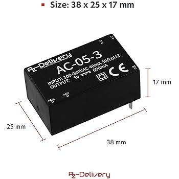</td>
	<td>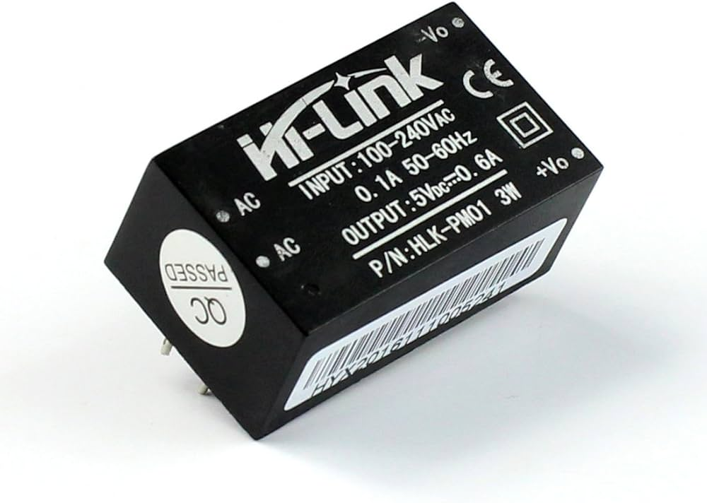</td>
  </tr>
</table>  

sp32_5V_EXT
5V RAIL FROM EXTRA SEPARATE PWR SUPPPLY
ALLOWS TO POWER_ON/POWER_OFF XBOX WITH PAIRED GAMEPAD
Simple way, without separate pwr supply for esp32 - connect ESP_5V_EXT with RAW_5V - common 5V rail of all Arduinos powrered from USB ports  
RAW IN EVERY ARDUINO IS after fuse and diode, connecting them together is some sort of O-ring - safe for usb ports.

...TODO...info,pics...

