---
# BROGX HW2 Build Instruction

**HW2 significantly increases the number of required connections and is therefore not recommended for beginners in electronics.**

The key feature of HW2 is **active port connection detection**.  
This allows for a clean internal installation without interfering with wired Xbox controllers — wired controllers always take precedence on the bus.  
It also enables the use of an external multi-port adapter without requiring every port to be populated with a controller or adapter.

Power & Reset management are **optional features** supported in HW2.

**Not every option described here is mandatory** — many can be implemented differently or skipped entirely while still achieving a functional build.

This guide focuses on **hardware integration** using **ESP32 DevKit-style modules**.  
If building from bare ESP32 modules (without dev board), additional protection circuitry will be required (already present on most DevKit boards).

→ Refer to the **[PDF Schematic](BROGX-HW2.pdf)** for detailed pin assignments and component placement.

---
# Materials Needed

### ESP32-DEVKITC with ESP-WROOM-32, ESP32-WROOM-32D, ESP-WROOM-32E, or ESP-WROOM-32U module

- **ESP32-WROOM-32U** (with external antenna socket) — best choice for HW2 internal builds.
- Example: **ESP32-DEVKITC V4** with ESP32-WROOM-32D module.

All [ESP32-WROOM modules](https://products.espressif.com/#/product-comparison?names=ESP32-WROOM-32E-N4,ESP32-WROOM-32UE-N4,ESP32-WROOM-32D-N4,ESP32-WROOM-32U-N4,ESP32-WROOM-32-N4,ESP32-WROOM-32E-H4,ESP32-WROOM-32UE-H4,ESP32-WROOM-32D-H4,ESP32-WROOM-32U-H4&type=Module)  
with **26 GPIO pins** and **4MB Quad Flash** are compatible.

### Arduino Boards

- Up to **4× Arduino Pro Micro / Leonardo**
- Must be **5V / 16MHz** versions

Example:  
https://www.aliexpress.com/item/New-Pro-Micro-for-arduino-ATmega32U4-5V-16MHz-Module-with-2-row-pin-header-For-Leonardo/32768308647.html

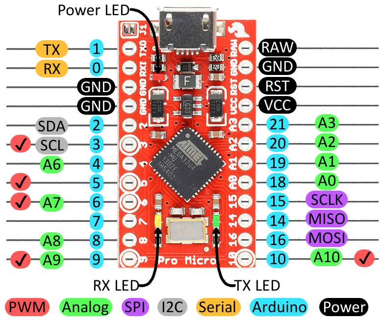
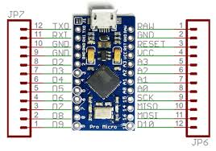

### Logic Level Converter

- Bi-directional logic level converter (recommended SparkFun type)

https://www.sparkfun.com/products/12009

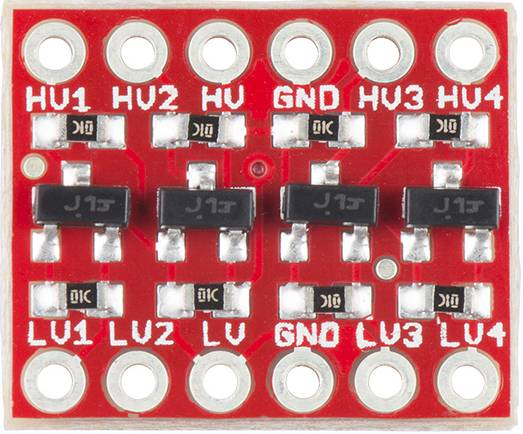

### Gameport Cables

- Up to **4× Xbox Controller Port → MicroUSB cables** (external HW2)

- OR up to **4× MicroUSB plugs/cables** for internal builds.

### Optional Additional Components

Needed only for extended functionality:

- For port detection circuits - MOSFETs, resistors
- Shield/GND  isolation - resistors
- Player status - LEDs, resistors

---  
# Connections  
<table border="0">
  <tr>
    <td valign="top">
      <!-- Twoja ulubiona tabela -->
      <table align="left">
        <thead>
          <tr>
            <th align="left">Player</th>
            <th align="left">Wiring</th>
          </tr>
        </thead>
        <tbody>
          <tr><td>Player 1</td><td>A2 (pin 6) + A1 (pin 7) → GND</td></tr>
          <tr><td>Player 2</td><td>A1 (pin 7) → GND</td></tr>
          <tr><td>Player 3</td><td>A2 (pin 6) → GND</td></tr>
          <tr><td>Player 4</td><td>No modification</td></tr>
        </tbody>
      </table>
    </td>
    <td valign="top" style="padding-left: 20px;">
      
       
      
<i>Arduino Basic Wiring</i>

    </td>
  </tr>
</table>  

--- 

## I²C Bus Connections  

~~⚠️**Critical note:** In the firmware, ESP32 I²C pins are **swapped** compared to default labeling!~~  
The I2C pin assignment in the code now matches the hardware diagrams.

- SDA = **GPIO21**  
- SCL = **GPIO22**
- GPIO21 → Level Shifter **LV1**  
- GPIO22 → Level Shifter **LV2**

Connections:

- **RAW** (5 V) from all Arduinos → Level Shifter **HV** side  
- **D2 (SDA, pin 8)** from all Arduinos → Level Shifter **HV1**  
- **D3 (SCL, pin 7)** from all Arduinos → Level Shifter **HV2**  
- **ESP32 3V3** → Level Shifter **LV**  
- **ESP32 GND / ARDUINO GND** → Level Shifter **GND** (connect both HV and LV GND)  
- **ESP32 GPIO21 (SDA)** → Level Shifter **LV1**  
- **ESP32 GPIO22 (SCL)** → Level Shifter **LV2**

  <a href="../HW1/BROGX_HW1_pictures.pdf">
    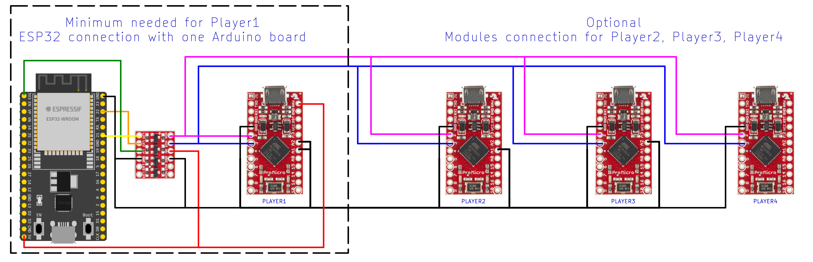
  </a>

---

## GAMEPORTS

See [Gameport Schematic](BROGX-HW2_ARDUINOS_TO_PORTS.pdf) for wiring.  
You can use MicroUSB cables or solder directly.

<table>
  <tr>
    <td>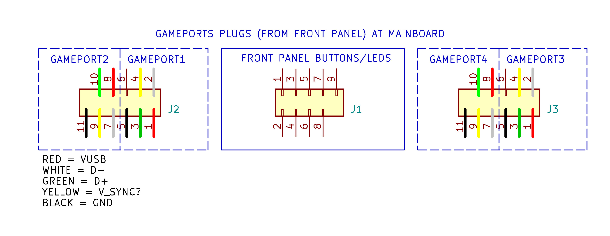</td>
  </tr>
</table>

| Player 1 (Left Plug) | Player 2 (Left Plug) | Player 3 (Right Plug) | Player 4 (Right Plug) |
| :--- | :--- | :--- | :--- |
| **D+** → Green (Pin 3) | **D+** → Green (Pin 10) | **D+** → Green (Pin 3) | **D+** → Green (Pin 10) |
| **D−** → White (Pin 2) | **D−** → White (Pin 7) | **D−** → White (Pin 2) | **D−** → White (Pin 7) |
| **VUSB** → Red (Pin 1) | **VUSB** → Red (Pin 8) | **VUSB** → Red (Pin 1) | **VUSB** → Red (Pin 8) |
| **GND** → Black (Pin 5) | **GND** → Black (Pin 11) | **GND** → Black (Pin 5) | **GND** → Black (Pin 11) |

  <a href="../../Images/promicro_usb_pins.jpg">
    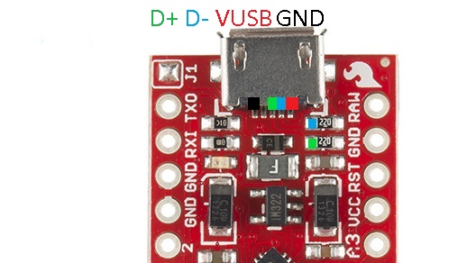
  </a>

  

---

## Port Detection 

To avoid original wired controller and BlueRetro from interfering each other on the controller bus, some sort of mechanism need to be used to drive the corresponding port detection pin.  
Each port pin should be pulled **HIGH** for use with Arduino connected to the corresponding port.  
Pins should read **HIGH** when no wired controller is connected to the port.  
**Unused ports** must not float, connect **10 kΩ pulldown** to GND.  
See [Port Detection](BROGX-HW2_PORT_DETECTION.pdf) for wiring.   

**Detection input GPIOs:**  
- GPIO35 → Player 1  
- GPIO36 → Player 2  
- GPIO32 → Player 3  
- GPIO33 → Player 4  
---  

### OPTION 1: ~~Current Trigger / Current Mirror Detection~~

     deprecated: unstable during rumble
     causing controller disconect when rumble starts due to too high voltage drop - Not recomended now.
     Current mirror circuit got at output about 0,3V voltage drop in idle , with rumble on voltage drops under acceptable
     USB spec and controller disconnects.     
*If anybody skilled in electronics wants help and got idea how detection can be done pls contact me!
[Reddit](https://www.reddit.com/u/konwektor), or [Discord](https://discordapp.com/users/konwektor)*  

  <a href="../../Images/BROGX_HW2_PORT_DETECTION_CURRENT_MIRROR.png">
    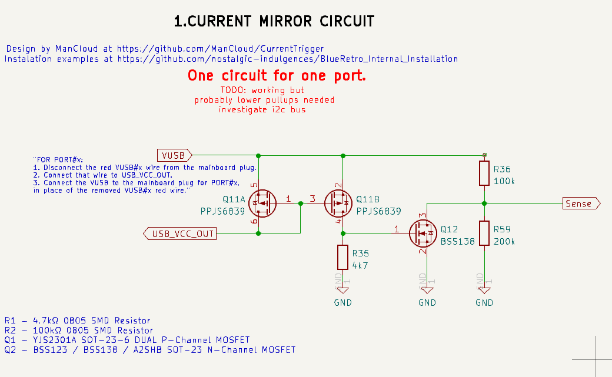
  </a>

  

This circuit checks if any port is drawing current.  
If yes → output **SENSE = LOW**.  
Build one **Current Mirror circuit** for every required port  
Connect each circuit’s **SENSE** output to the corresponding **ESP32 GPIO** detection pin.  

### OPTION 2 — GND Isolation Detection

Disconnect the **black ground wire** from each gameport and connect it to the corresponding ESP32 detect pin.

Add a **10k pull-up to 3.3V**.
1. Disconnect the **BLACK GND wire** from each gameport on the Xbox mainboard:  
   - Player 1 left plug Pin 5  
   - Player 2 left plug Pin 11  
   - Player 3 right plug Pin 5  
   - Player 4 right plug Pin 11

2. Connect each disconnected black wire to the corresponding ESP32 GPIO (35/36/32/33).

3. Pull every detection GPIO up to **3.3 V** via **10 kΩ resistor**.

  <a href="../../Images/BROGX_HW2_PORT_DETECTION_GND_ISOLATION.png">
    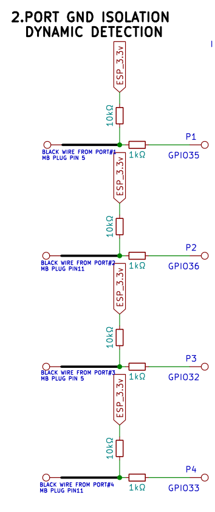
  </a>

  

***Explanation (example: Player 1):***
- Power goes from 3.3V thru 10 kΩ resistor to GPIO35 - GPIO35 is pulled HIGH.
- Black cable disconnected from plug Pin5(GND CONTROLLER PORT1)
- GND (black cable) is connected to the Xbox gameport ground pin → no change.  
- When a wired controller is plugged:
- Shield of gamepad → port shield → GND connection pulls GPIO LOW.  
- Adapter detects this and **disables** the port (USB detach).  
- BT controllers are reassigned automatically.  
- When unplugged → GPIO returns HIGH → BT controller rebinds.  

> **⚠️ Important:**  
> This method relies on the controller cable’s shield being connected to GND. Reliable contact between the cable shield and the port shield is mandatory. Poor grounding or damaged cable shielding may result in unreliable detection.

### OPTION 3: PORT SHIELD ISOLATION (Recommended)
This is the preferred method as it is reliable, easy to implement.

Port shield isolation = dynamic / hot-plug port detection:
Requires one 10 kΩ resistor per port. Place insulation (e.g., Kapton or insulating tape) between the metal shield of each port and the Xbox chassis shield. Solder a wire to the port shield or, alternatively, instead of soldering, you can firmly press a stripped copper wire against the port shield and secure it with the insulating tape. Connect this wire to the corresponding port detection pin and a 10 kΩ pull-up resistor to the ESP 3.3V rail. 
 
> **⚠️ Important:**  
> This method relies on the controller cable’s shield being connected to GND. Reliable contact between the cable shield and the port shield is mandatory. Poor grounding or damaged cable shielding may result in unreliable detection.  

  <a href="../../Images/BROGX_HW2_PORT_DETECTION_SHIELD_ISOLATION.png">
    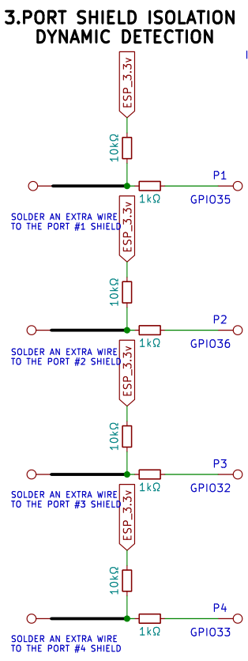
  </a>

  

### OPTION 4: PULLUP ONLY / NO DETECTION  PORT DISABLED FOR WIRED GAMEPADS

Static port count without detection.  
To enable a port for BT devices, a 10kΩ resistor per port is needed.  
Pullup to ESP_3.3V power rail via resistor.  
Ports always enabled for Arduino, Bluetooth permanently enabled on pulled-up ports.  
Connecting Wired gamepads to ports enabled in this way is in conflict with already used there Arduinos.  
Wired gamepads Will not work and cause problems, or even system hangs.

  <a href="../../Images/BROGX_HW2_PORT_DETECTION_PULLUP_ONLY.png">
    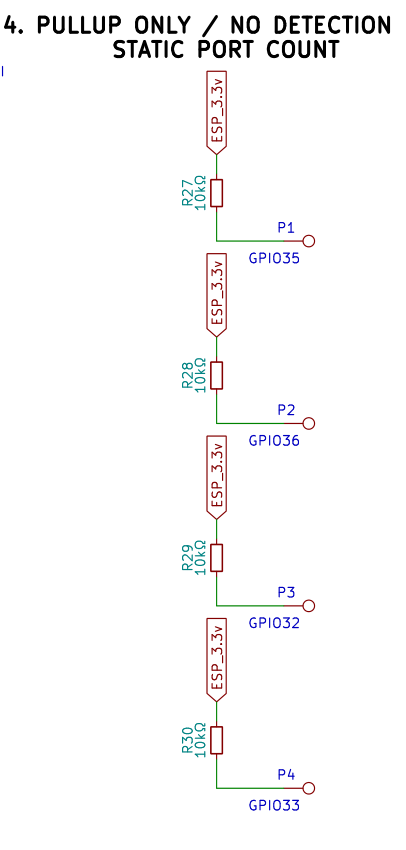
  </a>

  
.  

     

### OPTION 5: PULLDOWN ONLY/ NO DETECTION PORT DISABLED FOR BT

After building port detection circuit using one of the methods above, unused detection pins should be pulled to GND thru 10kΩ resistors.
This will set gpio pins state to LOW, avoiding risk of floating.
Coresponding port is disabled by adapter for use with Bluetooth. 

  <a href="../../Images/BROGX_HW2_PORT_DETECTION_PULLDOWN_ONLY.png">
    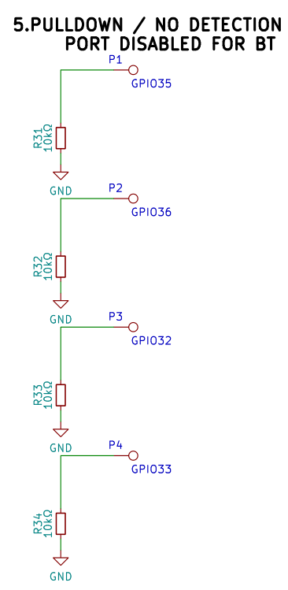
  </a>

  

---  

## FRONT PANEL BUTTONS  
See [Front Panel](BROGX-HW2_FRONT_PANEL.pdf) for wiring.

Normaly for **BlueRetro pairing/reset**, the ESP32’s  **EN** and **BOOT** buttons are used.  
This circuit allows using XBOX **DVD_EJECT** and **POWER_ON/OFF** buttons for **BlueRetro** functions (pairing/reset) while maintaining standard Xbox functionality.   

### Benefits:  
*   **Normal Xbox Behavior:** Standard power/eject functions still work as expected.
*   **Dual Functionality:** Buttons trigger BlueRetro pairing/reset plus standard Xbox control.
*   **Remote Power Control:** 
    *   Possibility of switching **XBOX OFF** from a connected Bluetooth wireless gamepad.
    *   Possibility of switching **XBOX ON** from an already paired Bluetooth wireless gamepad.  
    ⚠️*Requires a separate permanent power supply for the ESP32.*
*   **Fallback:** Without this circuit, Xbox buttons behave normally (no BlueRetro control).  
In this case, **ESP32 EN** and **BOOT** buttons must be manually accessible (e.g., extended outside the Xbox case).  

## Hardware Design Variants
Two hardware builds are supported. Switching between them requires a code update (re-compilation) to redefine GPIO modes and polarities.  

### How to Switch Configuration:
**Method 1: Using menuconfig**
*   Navigate to `Component config -> BlueRetro -> Hardware Options`.
*   Set **Use PUSH-PULL OGX360 Hardware design(N-MOSFETs)** to **true** (Note: this depends on `BLUERETRO_SYSTEM_OGX360` being active).

**Method 2: Manual sdkconfig edit**
*   Copy the `hw2_ogx360` configuration file from the `configs/hw2` folder to the main `blueretro/` folder and rename it to **sdkconfig**.
*   Open the file and change the following line:
    *   From: `CONFIG_BLUERETRO_HW_PUSH_PULL=n`
    *   To:   `CONFIG_BLUERETRO_HW_PUSH_PULL=y`
*   Recompile the project.

> **⚠️ Important:**   
> *N-MOSFET Design:*  The RESET_PIN is initialized at LOW (0) for OGX360 to maintain correct state through the MOSFET circuit.  
>
> *Diode Design:*  Both POWER and RESET pins are initialized at HIGH (1) before the GPIO configuration update. This unconventional 
sequence prevents "ghost" button presses (random power-ups or ejects) when the ESP32 transitions the pins from high-impedance inputs to Open-Drain outputs.

### Option A: N-MOSFET Design (Push-Pull)
*   **Status:** *Used in release v25.04.*
*   **Configuration:** *Intended for GPIO pins set as OUTPUT (Push-Pull).*
*   **Safety:** *Protects ESP32 from "back-powering" via Xbox 3.3V_STBY using MOSFET isolation.*  
*   **Pros:** *Safe in all power configurations (with or without extra power supply).*
*   **Cons:** *Moore Components need to build circuit.*
*   **Logic:** *`RESET_PIN` is initialized at LOW (0) for OGX360 to maintain correct state through the MOSFET circuit.*

  <a href="../../Images/BROGX_HW2_FRONT_PANEL_PUSH_PULL.png">
    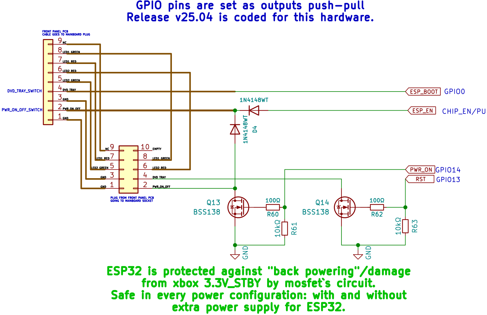
  </a>

  

### CONNECTIONS  
Front panel cable originates from the Xbox front panel and ends with double-row 9-pin motherboard connector at XBOX motherboard.  
- Power (ON/OFF) button  (PIN2)
- DVD Tray Eject button  (PIN4)
- LED indicator signals  (PIN:5,6,7,8)
- GND (PIN1,PIN3)

From the **double-row 9-pin motherboard connector**, disconnect:
- **Pin 2 → PWR_ON_OFF**
- **Pin 4 → DVD_TRAY**

Two **N-channel MOSFETs (BSS138)** are used as low-side switches.
- **Q1 drain → PWR_ON_OFF (Pin 2)**
- **Q2 drain → DVD_TRAY (Pin 4)**  
These lines are internally pulled up inside the Xbox using **10 kΩ resistors to 3.3V (3.3V_STBY if XBOX is OFF)**.  

The MOSFET gates are driven by control signals:  
- **PWR_ON (GPIO14) → Q1 gate via R6 (100 Ω)**
- **RST (GPIO13) → Q2 gate via R8 (100 Ω)**

Each gate includes a pull-down resistor:  
- **R7 / R9 = 10 kΩ**  

These ensure a default **LOW (OFF)** state when the control signal is floating.  
- **R7 / R9 (10 kΩ)** keep MOSFETs OFF during power-up or when the controller is disconnected.
- **R6 / R8 (100 Ω)** Limit gate charging current and reduce EMI and switching oscillations.  

On the **PWR_ON_OFF drain line**:
- A diode is connected with its **anode to the drain**.
- Its cathode connects to a shared node.  
This node is also connected to:
- Another diode from the **ESP_EN** signal
- The original front panel **Power Button** line

Pressing the power button pulls this node to **GND**, activating the **XBOX POWER_ON_OFF** signal simultaneously with **ESP_EN**. This ensures that even if the ESP32 hangs, the console can still be powered on, and the chip can be manually reset via the physical button.

ESP32 Signal Connections:
- **ESP32 GPIO0 (BOOT)** → connected to the DVD_TRAY line (Pin 4 cable) - 
- **ESP32 EN (CHIP_PU)** → connected to the anode of a diode:
  - **1N4148WT** (recommended)
  - or **BAT54** (alternative)

The diode cathode connects to:
- **PWR_ON_OFF cable (Pin 2)**  
### Option B: Simplified Diode Design (Open-Drain) — [CURRENT MAIN BRANCH]
*   **Status:** *Recommended for new builds.*
*   **Configuration:** *Intended for GPIO pins set as OUTPUT_OD (Open-Drain).*
*   **Pros:** *Minimalist design (only 2 diodes needed).*
*   **Cons:** **⚠️ Critical Warning:** *The ESP32 must be powered at all times! If not, the Xbox 3.3V_STBY will back-power the ESP32 through the internal clamping diodes (GPIO13 and GPIO14), leading to unpredictable behavior or hardware damage.*
*   **Logic:** *Both `POWER_ON` and `RESET_PIN` pins are initialized at HIGH (1) before the GPIO configuration update. This unconventional sequence prevents "ghost" button presses (random power-ups or ejects) when the ESP32 transitions the pins from high-impedance inputs to Open-Drain outputs.*  

*   **Recommended Diodes:** Use **1N4148WT**, **BAT54**, or any equivalent **Schottky diode**.
*   **Why Schottky?** These diodes have a very low forward voltage drop (approx. **0.3V**), ensuring stable signal levels for the Xbox front panel logic.

  <a href="../../Images/BROGX_HW2_FRONT_PANEL_OD.png">
    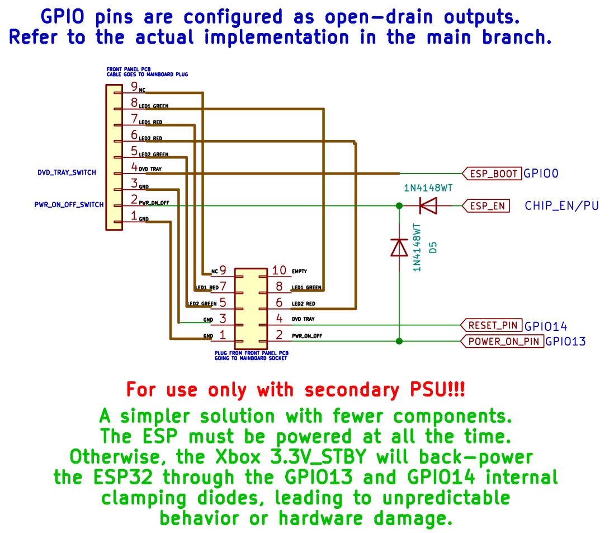
  </a>

  

---

## Status & Player LEDs  
 
See [STATUS LEDS](BROGX-HW2_STATUS_LEDS.pdf) for wiring.  

### BR status LED IS HIGHLY RECOMMENDED  
**BR status LED need to be connected to 3.3V rail, and only to 3.3V rail!**  
User can always see/be sure what is happening with adapter; is it in pairing/inquiry mode, or not , or maybe crashed.  
Very usefull. Pairing is always pulsing, if it is done or pairing is off - led is off.  
When adapter got crashed, or is hanging - led will be solid  

### Player LEDs (if used)

LED PINS FOR P1,P3,P4 (GPIO2, GPIO12, GPIO15) ARE ESP32 STRAPPING PINS!
**Interface via MOSFET**  
Using a MOSFET to drive the LEDs is **essential** to prevent issues during boot/bootloop caused by LED current during ESP32 startup.

**Power connection options:**
- LEDs powered from **ESP_3V3** → use internal ESP32 regulator  
- LEDs powered from **ESP_5V_EXT** → use separate 5V power supply or XBOX 5v rail  

**Resistor Calculation**  
The 64 Ω resistors shown in the schematic are **examples only**.  

You **must** calculate and select the correct resistor value based on:  
- The specific LED type and color you are using [LED forward voltage (Vf) and desired current (If)]
- Chosen supply voltage (3.3V or 5V)

Refer to the typical values tables at the top of this section for guidance.  

  <a href="../../Images/BROGX_HW2_STATUS_LEDS.png">
    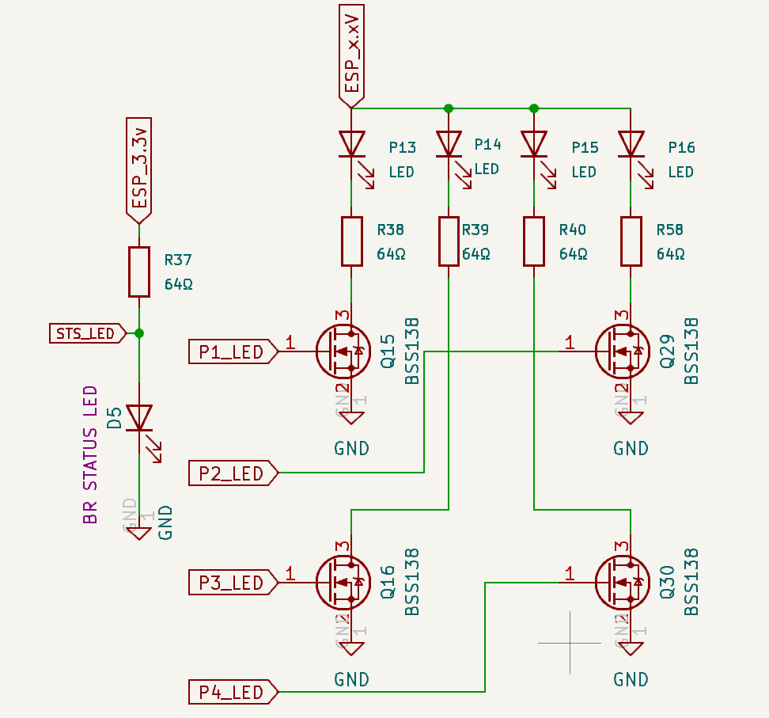
  </a>

  
---
 
  
 
					
## ESP32 POWER  

- **ESP_3V3**    = 3.3 V from ESP32 board (logic, pull-ups, low-current use)  
- **ESP_5V_EXT** = 5V main ESP32 power

**Integration options:**

1. **Full separation (recommended for BT power-ON/OFF)**  
   ESP_5V_EXT  from separate AC-DC module (main ESP32 power) 
   Arduinos powered from Xbox USB Vbus (as usual)  
   When using a dedicated ESP32 power supply, the ESP32 can power on independently of the Xbox.  

2. **Shared / O-ring (simpler, no wireless power-ON, but still can do power-OFF)**  
   Connect ESP_5V_EXT → **RAW** pins of all Arduinos in parallel  
   (RAW already has fuse + diode → safe OR-ing behavior)  
   The ESP32 shares power with the Xbox and follows the console's power state.  

Xbox standby rail provides only ~100mA.  
ESP32 can draw up to ~180mA during Bluetooth transmission. XBOX 3V3_STBY is too weak, and can`t be used for powering ESP32. 

Therefore an **external PSU is required**.
Small enough to fit inside Xbox, and strong enough for powering ESP32. 

Popular compact modules:

| Module                  | Input       | Output     | Approx. size   | Notes                              |
|-------------------------|-------------|------------|----------------|------------------------------------|
| Hi-Link HLK-PM01        | 100–240 VAC | 5 V / 600 mA | 34 × 20 × 15 mm | Very popular, reliable             |
| AZ-Delivery AC-DC 5 V   | 100–240 VAC | 5 V / 700 mA | ~ similar      | Budget-friendly alternative        |    

<table>
  <tr>
    <td>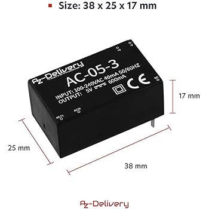</td>
	<td>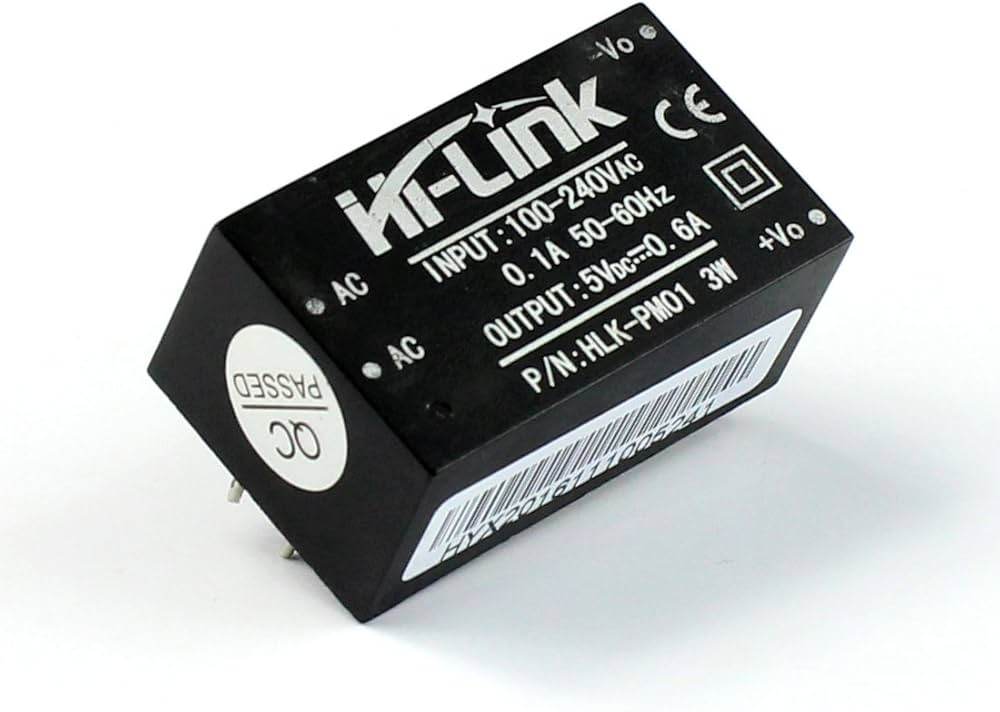</td>
  </tr>
</table>  

...TODO...info,pics...

## 5. Power Detection Logic (GPIO39 / PWR_DET)

The ESP32 needs to sense the Xbox power state to handle pairing and wake-up functions correctly. Choose one of the following methods based on your power configuration:

### SCENARIO A: SHARED - ESP32 powered ONLY when Xbox is ON
In this configuration, the adapter is only active when the console is running.
*   **Connection:** Connect **GPIO39** directly to the **ESP_3.3V** rail.
*   **Protection:** For added safety, add a **1 kΩ resistor in series**.
*   **Result:** The system will always detect the "Power ON" state as long as the ESP32 is powered.

### SCENARIO B:FULL SEPARATION - ESP32 powered all the time from external PSU
If the ESP32 is powered independently (allowing for remote wake-up), use one of these methods to sense the Xbox power state:

*   **LPC Debug Port:** Connect to **Pin 9** or **Pin 15** of the Xbox LPC header (3.3V rail). 
    *   *Wiring:* Use a **1 kΩ series resistor** to the pin and a **10 kΩ pull-down resistor** from GPIO39 to GND. This rail is active only when the Xbox is ON.
*   **Xbox 5V/9V/12V Rails:** Use any main power rail (except 3.3V_STBY) with a properly calculated **voltage divider** to bring the signal down to **3.3V max**.
*   **Level Shifter (4-Port builds):** If using only 2 ports, you have free channels on your level shifter. Connect the Xbox voltage rail to the **High Side (HV)** and GPIO39 to the **Low Side (LV)**.
*   **USB Power (RAW_5V):** You can sense the 5V supply from the controller ports using a voltage divider or a level shifter.

> **💡 Reference:** For detailed photos and locations of power points, refer to the [RetroSix Wiki: Power Rails XBOX v1.0](https://www.retrosix.wiki/power-rails-v10-xbox-original).
 

# POWER STATE DETECTION

GPIO39 — PWR_DET.

Connection rules unchanged — grammar corrected.

---

