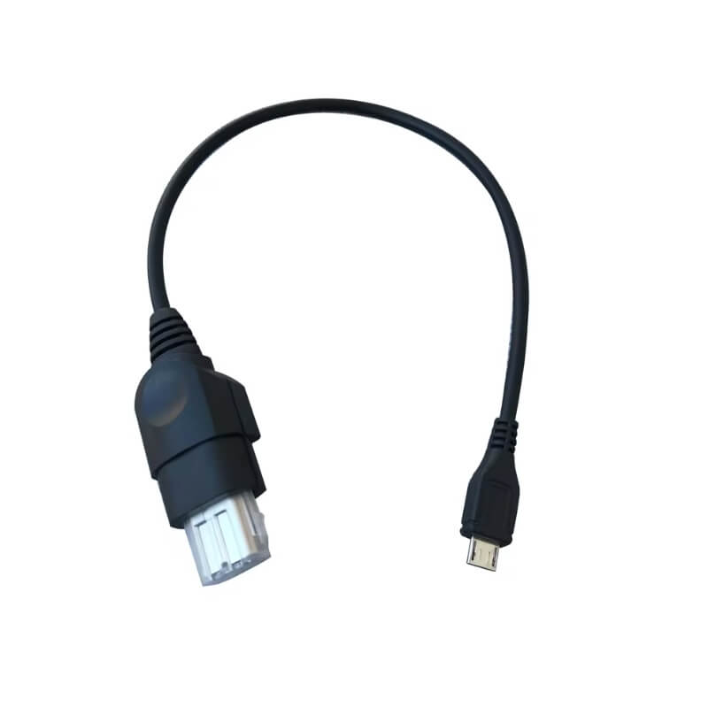

BROgx HW2 build instruction

[Detailed Schematic](BROgx_HW2.pdf) 

Lets assume we are using also like in HW1 build :ESP32-DevKitC V4, and Arduino ProMicro/leonardo 
## Connections

Same story as in HW1 - for communication over i2c beetwen 2 devices with different SDA/SCL voltage level (arduino accepts 5V, Esp32 3,3V) we need to use Bidirectional Level shifter!!!

For example [SparkFun Logic Level Converter - Bi-Directional](https://www.sparkfun.com/products/12009)

Wiring

For Player 1: Connect right side pin6 (A2), and pin7 (A1) on the Arduino to ground(GND).

For Player 2: Connect right side pin7 (A1) on the Arduino to (GND).

For Player 3: Connect right side pin6 (A2) on the Arduino to (GND).

For Player 4: Don't connect any additional pins to ground.

  

Connect right side pin4 (Vcc) from Arduino for Player1,  with Level shifter (HV).

Connect (GND) from Arduino for Player1 with Level shifter (GND) on HV side.

If You got more Arduino boards connect (GND) from all Arduino boards together.

Connect left side pin8 (D2/SDA) on all Arduinos together and with Level shifter (HV1)

Connect left side pin7 (D3/SCL) on all Arduinos together and with Level shifter (HV2)

Connect left side top (3V3) pin on ESP32 with Level shifter (LV)

Connect  ground pin (GND) from ESP32 with Level shifter (GND) on LV side. 

Connect right side GPIO21 (SDA) from Esp32 with Level shifter (LV1).

Connect right side GPIO22 (SCL) from Esp32 with Level shifter (LV2).
IN CODE is mistake  sda at gpio22 /scl at gpio21 - 
NEED TO BE SDA21/SCL22
arduino sda is d2 /  scl is d3

colour to colour wiring job to do this as in Black to Black=Ground,
Red to Red =Vbus/Vcc/5 volts
Then Green to Green=D+(Data line)
And then finally White to White=D-(Data line)
As yellow is omitted as used for light guns etc (or for svideo i think ?)

  

Connect every used arduino board to xbox with XBOX Micro USB to Controller Port Cable.

  

Enjoy.

