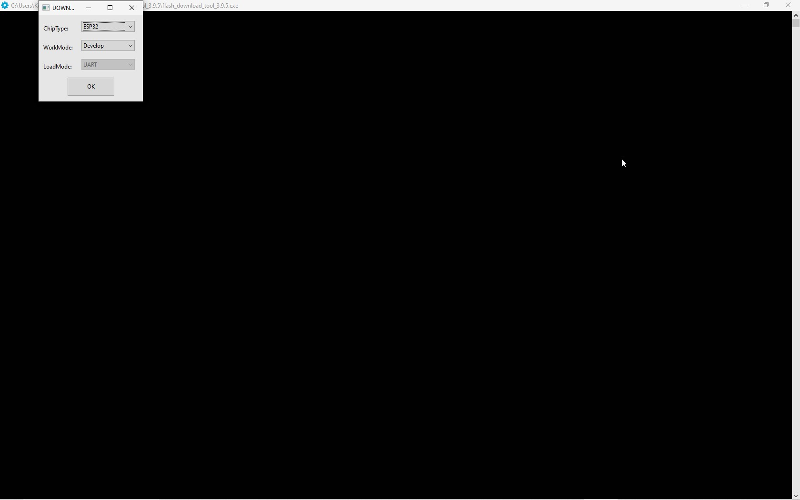
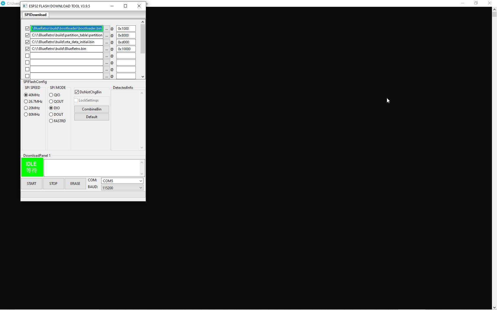

Just go to releases and download "BROGX.zip" file.
Use HW1 version for external hardware build or HW2 for external/internal build.
# ESP32  part :
I am using esp32-wroom32d DevkitC V4. 
Dowload [flash download tool](https://www.espressif.com/sites/default/files/tools/flash_download_tool_3.9.5.zip) 
Run program and set :
Chip Type : ESP32
WorkMode : Develop

  


Put all downloaded bin files into flash tool (3 dots), and set everything like on this screen.

  

Change COM to Yours -  Determine what COM number Esp32 appears in the device manager.
Click START - and done.


---


## ESP32 bare module 
In case of using ESP32 bare module (Steel box), there are not included any periferial chips like on DEVKITS, so it is not possible to programm ESP32 over USB.
Cheapest way is to use  USB to TTL device (simple ones cost about 3-5 dollars).

## Flashing a Bare ESP32 Module via UART (Without USB)

If your ESP32 module has a damaged USB interface or is a bare module without a preloaded bootloader, you can still flash it using a **USB-TTL adapter** via UART. The ESP32 has a built-in **ROM bootloader**, allowing it to enter flashing mode even without a preinstalled firmware.

---

## 1. Wiring the USB-TTL Adapter to ESP32

| USB-TTL | ESP32         |
|---------|--------------|
| TX      | RX (GPIO3)   |
| RX      | TX (GPIO1)   |
| GND     | GND          |
| VCC     | 3.3V *(Do not use 5V!)* |

**Additional connections for flashing mode:**  
- **IO0 → GND** *(before reset, to enter flashing mode)*  
- **EN → GND (momentarily)** *(to reset ESP32 and start the bootloader)*  

---

## 2. Entering Flash Mode
1. **Connect IO0 to GND.**  
2. **Reset ESP32** *(by briefly connecting EN to GND or power cycling the module).*  
3. **Release IO0 from GND.**  

Now, the ESP32 is in **UART bootloader mode**, ready for flashing.

---

## 3. Flashing the Bootloader and Firmware
If ESP32 does not have a bootloader, you need to flash the full firmware, including the **bootloader, partition table, and application firmware**.

Run the following command using `esptool.py`:

```sh
esptool.py --chip esp32 --port /dev/ttyUSB0 --baud 115200 write_flash -z \
  0x1000 bootloader.bin \
  0x8000 partitions.bin \
  0x10000 firmware.bin
```
*(Replace `/dev/ttyUSB0` with the correct port, e.g., `COM3` on Windows.)*

If you only need to flash the firmware (with an existing bootloader), use:

```sh
esptool.py --port /dev/ttyUSB0 --baud 115200 write_flash 0x10000 firmware.bin
```
---

## 4. Finalizing the Process

1. **Disconnect IO0 from GND.**
2. **Reset ESP32** (by pressing EN or power cycling it).
   
Your ESP32 should now boot into the newly flashed firmware.

---


# Arduino part :

* Download avrdude-6.3-mingw32.zip for Windows from  [avrdude](http://download.savannah.gnu.org/releases/avrdude/), and unzip it where you wish to.
*   Determine what COM number Arduino appears in the device manager.
*   Download firmware from https://github.com/konwektor/ogx360/releases/download/v1.00/Ogx360.zip
* Go into command prompt in Windows, change folder to avrdudes folder
* write command:
avrdude -C avrdude.conf -F -p atmega32u4 -c avr109 -b 57600 -P COMx -Uflash:w:firmware.hex:i
* !ALter COMx with Yours for arduino!
* Done.

