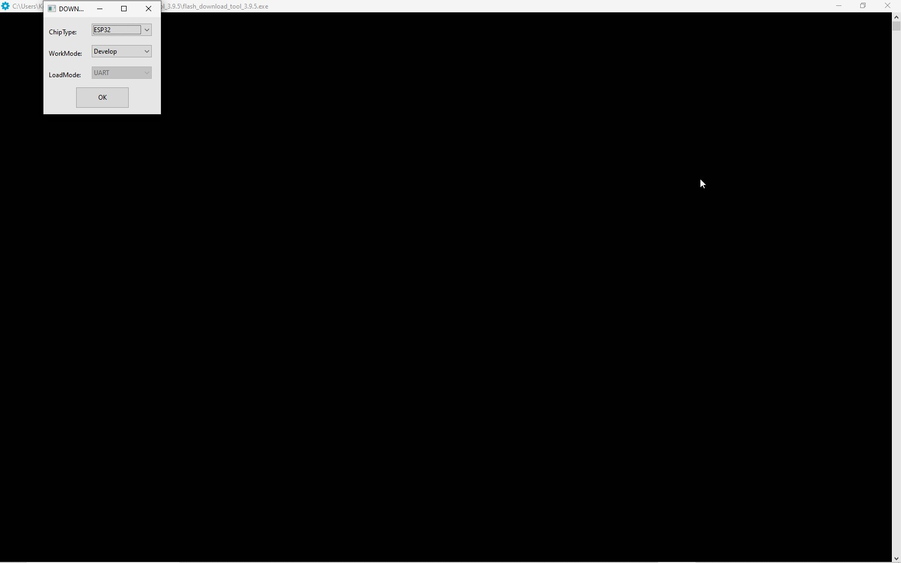
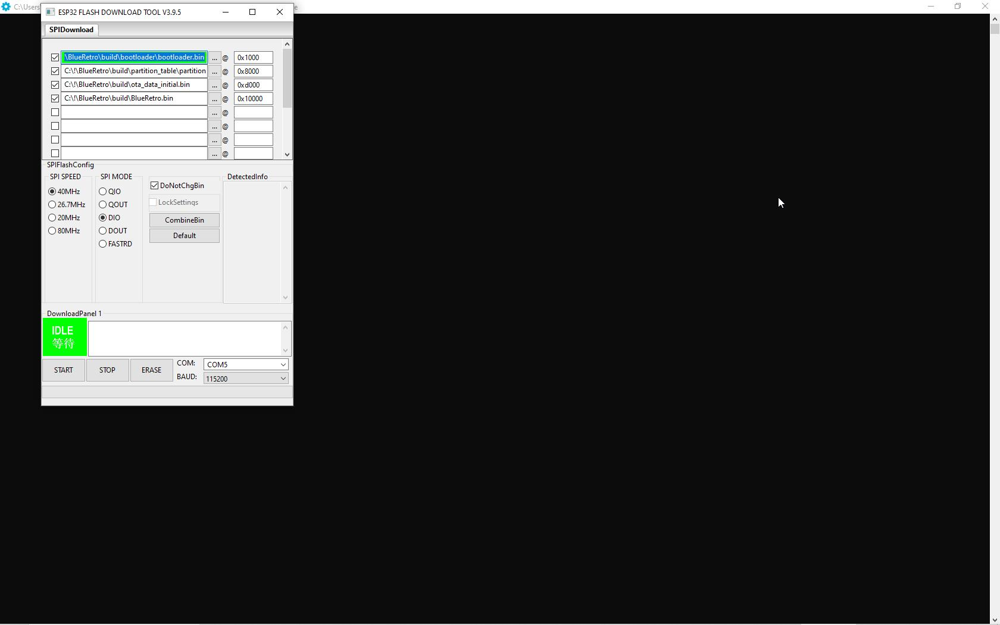

I have decided to call this mixed fork as BROgx because its 2modul roots - Blueretro project from Darthcloud and Ogx360 by Ryzee119. Simple...

# Programming

Just go to releases and download "BROgx360.zip" file.
Use HW1 version for external hardware build or HW2 for external/internal build.

## ESP32  part :
I am using esp32-wroom32d DevkitC V4. 
Dowload [flash download tool](https://www.espressif.com/sites/default/files/tools/flash_download_tool_3.9.5.zip) 
Run program and set :
Chip Type : ESP32
WorkMode : Develop

  

Put all downloaded bin files into flash tool (3 dots), and set everything like on this screen.

  

Change COM to Yours -  Determine what COM number Esp32 appears in the device manager.
Click START - and done.
## Arduino part :

* Download avrdude-6.3-mingw32.zip for Windows from  [avrdude](http://download.savannah.gnu.org/releases/avrdude/), and unzip it where you wish to.
*   Determine what COM number Arduino appears in the device manager.
*   Download firmware from https://github.com/konwektor/ogx360/releases/download/v1.00/Ogx360.zip
* Go into command prompt in Windows, change folder to avrdudes folder
* write command:
avrdude -C avrdude.conf -F -p atmega32u4 -c avr109 -b 57600 -P COMx -Uflash:w:firmware.hex:i
* !ALter COMx with Yours for arduino!
* Done.

# This BROgx Instruction is mostly modified BlueRetro's documentation  
Instant knwolege , pairing, physical buttons usage and system behaviour, combo commands, web config, etc. 
For deatiled information go to Darthclouds [BlueRetro wiki page](https://github.com/darthcloud/BlueRetro/wiki).

# 1 - Building hardware HW1
HW1 hardware build is quite simple, just follow instructions.
* [Building HW1 Instructions](Hardware/HW1/README.md)

# 2 - Building hardware HW2

HW2 specification require a lot more connection and as such is not recommended
for novice in electronic at all. HW2 main feature is active port connection detection.

* [Building HW2 Internal Instructions](Hardware/HW2/README.md)

It is also possible to use BROgx HW2 as external adapter.
* [Building HW2 External instructions](BlueRetro-HW2-External-Specification)

Power management (XBOX power ON/OFF) is optional feature supported by HW2 internal - ESP32 need to be all time powered on for that
* [powering Esp32]

# 2.1 Currently ocupied port Rumble Feedback HW2
Because xbox gamepads doesn`t have player slot/place feedback (colours or diodes), exept xbox360 gamepads, but they are not supported by BROgx,
I have added small rumble feedback function - after succesfully connection, pushing XBOX button, or similar button in other controlller, will cause
controller to  rumble n-times, where n is the number of actually used port.
If orginal xbox gamepad is plugged in, to this slot, all connected controllers jumps over to first free and not occupied by wired gamepad slot. 
This also affect in rumble feedback n-times.  

[Nostalgic Indulgences](https://twitter.com/nosIndulgences) created multiple guides base on HW2 for internal install:: https://github.com/nostalgic-indulgences/BlueRetro_Internal_Installation\
[TharathielCB](https://github.com/TharathielCB) created BR4N64, an internal BlueRetro Flex-PCB for the Nintendo 64: https://github.com/TharathielCB/BR4N64

# 3 - Pairing Bluetooth controller

In default configuration BlueRetro is always in inquiry mode (IO17 LED pulsing) if no controller is connected\ or in hw2 internal/external when system is on, and no controller connected
Pair via inquiry first.
You may change this behavior by switching inquiry mode in the web config to manual.
When manual - When XBOX is ON, and no BT controller is connected Pressing DVD TRAY button for 3 sec will activate inquiry mode.
Already paired BT controller can switch XBOX ON(only in HW2 internal with powering ESP32 variant), or OFF(HW2 internal)

[Controller List & Pairing Guide](Controller-pairing-guide)

# 4 - Web config

Power on system and connect via Web Bluetooth at https://blueretro.io to configure adapter.\
**The config mode is only available if no controller is connected.** \ **Disconnect every controlller from BROgx360 to connect to Web configurations pages.**
web pages works only partly for BROgx360 - adapter isn officialy supported by Darthcloud
**Supported only in Desktop or Android Chrome**
See [BlueRetro BLE Web Config User Manual](BlueRetro-BLE-Web-Config-User-Manual) for more detail.

# 5 - Physical buttons usage

## 5.1 - ESP32 button EN 

## 5.1.1 ESP32 button EN (Reset) External adapter
* Button press resets ESP32

## 5.1.2 ESP32 button EN (Reset) Internal adapter
* connected to XBOX power button - resets ESP32 together with xbox power ON or OFF signal (depends if XBOX is ON or OFF)

## 5.2 - BOOT (IO0) External adapter
* Button press under < 3 sec (All LEDs solid):\
  If in pairing mode: Stop pairing mode otherwise all BT devices are disconnect.
* Button press between > 3 sec and < 6 sec (All LEDs blink slowly):\
  Start pairing mode.
* Button press between > 6 sec and < 10 sec (All LEDs blink fast):\
  Factory reset ESP32 to original BlueRetro firmware the device shipped with & reset configuration.

## 5.3 - BOOT (IO0) Internal install
  Connected/used as XBOX DVD Tray button.
  
### 5.3.1 - System behavior while ESP32 on and xbox on
* Short press DVD / or press under < 3 sec (All LEDs solid):\
  DVD Tray open/close
* Longer press > 3 sec does not open/close DVD Tray, depends of time is :

* DVD Button press between > 3 sec and < 6 sec (All LEDs blink slowly):\
  If in pairing mode: Stop pairing mode otherwise all BT devices are disconnect.
* Button press between > 6 sec and < 10 sec (All LEDs blink fast):\
  Start pairing mode.
* Button press over > 10 sec (All LEDs blink very fast):\
  Factory reset ESP32 to original BlueRetro firmware the device shipped with & reset configuration.
* Quick double press:\
  System is powered down via power relay / power pin.

### 5.3.2 - System behavior while ESP32 off & system off
* Holding DVD and then powering system put the ESP32 in sleep mode. Power on with already paired controller not possible.!!!

### 5.3.3 - System  behavior while ESP32 on & system off
* Short press DVD: XBOX is powered on via power pin
* Long press DVD & release: Power on and also DVD open signal.

### 5.3.4 - System  behavior while ESP32 off and system on
* While the ESP32 is in boot mode or in deep sleep the system reset function is lost.
* We dont have anymore BlueRetros "system reset" - behaviour of reset pin is used for BROgx DVD Tray opening/closing.

# 6 - Button combinations functions
Their is two forms of button combo to activate macro functions:
* LT+RT+START+ CommonFunction
* LT+RT+START+Y+ RestrictedFunction

The default mapping for the common function last button:
* X -> BROgx DVD Tray eject/close. BlueRetro System Reset  
* A -> System Shutdown/Controller disconnect
* B -> Toggle BT pairing mode on/off
* BACK (Select) -> Toogle wired output mode between GamePad & GamePadAlt - Not used in BROgx, not now....

The default mapping for the restricted function last button
* D-pad Up -> Factory Reset
* D-pad Down -> Disable BlueRetro (Deep sleep)

These default can be modified via the [advance config mapping section](https://github.com/darthcloud/BlueRetro/wiki/BlueRetro-BLE-Web-Config-User-Manual#24---mapping-config).\
Those mapping are generaly located at the end of the mapping list.\
Simply change the source button to alter the mapping of a base, common function or restricted function button.
gamepads mapping for specified adapter / output number.... x/ works also fo BROgx360

Refer to [BlueRetro mapping reference](https://docs.google.com/spreadsheets/d/e/2PACX-1vT9rPK2__komCjELFpf0UYz0cMWwvhAXgAU7C9nnwtgEaivjsh0q0xeCEiZAMA-paMrneePV7IqdX48/pubhtml) to translate BlueRetro label to specific system button names.

# 7 - LED usage (IO17)

* See [5 - Physical buttons usage](#5---physical-buttons-usage) for LED meaning while button BOOT (IO0) is pressed/ (DVD button in BROgx360)
* Solid: An error occured, try power cycle, check serial logs for detail.
* Pulsing: Bluetooth inquiry mode enable (new pairing).
* Off: No error and Bluetooth inquiry mode disabled.

    

## READ THIS FIRST
* [Project documentation](https://github.com/darthcloud/BlueRetro/wiki)

## Need help?
* [Open a GitHub discussion](https://github.com/darthcloud/BlueRetro/discussions)
